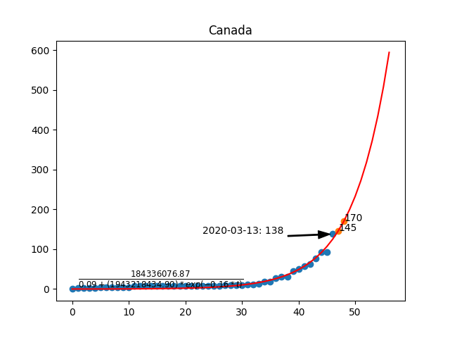
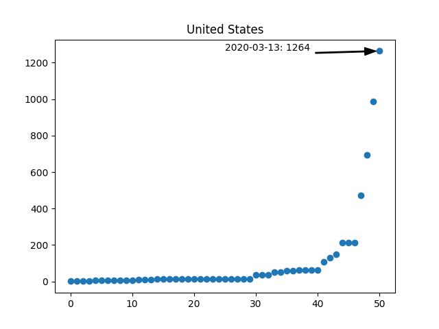
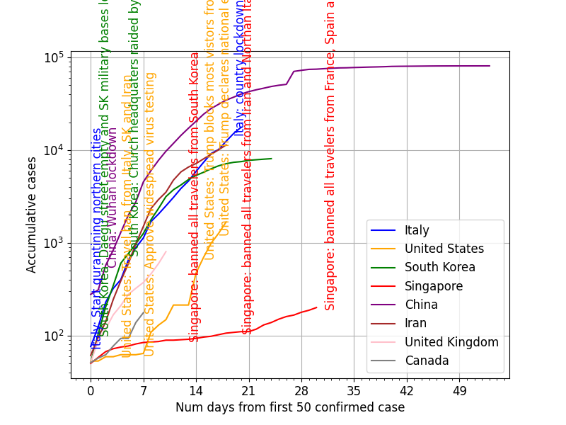
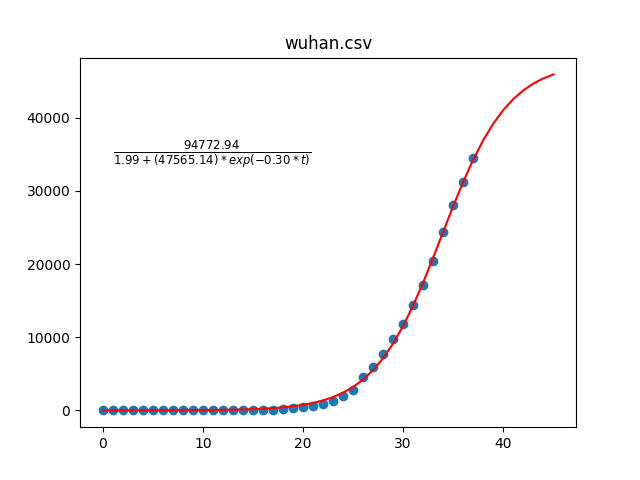
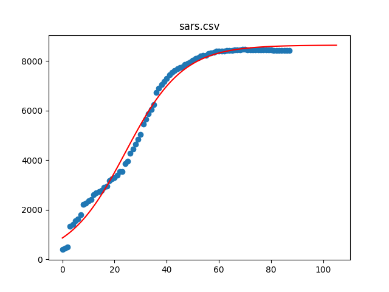

# Wuhan virus modeling

refer to https://www.zhihu.com/question/367466399 for model formula

## Using si_model

### Countries
Canada

US

Country Comparision

### Compare to SARS
Need more data for wuhan

Compare to SARS

### Todo

[ ] SIR model analysis
